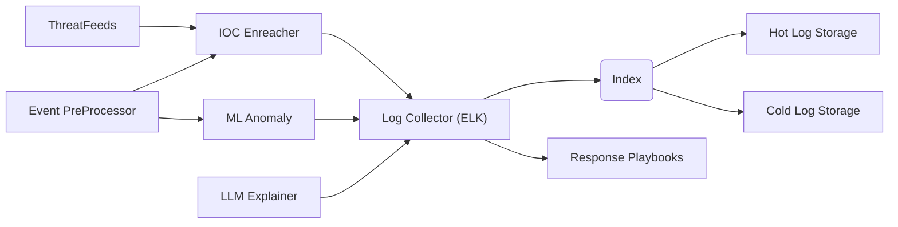

# RFQ 01 - LibreSIEM HLD

The following is an RFQ for the initial LibreSIEM HLD.

# Log Collection Backend Selection.

Upon research most of the exisiting SIEM solutions are built on top of other existing OpenSource / Shady License Centralized Logging Solutions. 
The biggest existing ones are:

- ELK Stack ( Service Side Pulic License SSPL ) Not OSI Backed License.
- Open Search ( Apache 2.0 )
- Graylog ( Service Side Pulic License SSPL ) Not OSI Backed License.

When we evaluated, we found the following itemss:

- Open Search is generally Lacking features, looks and stability. The community seems as a Hive of Frentic Unorganized Development. Project seem to be in its infancy still.
- ELK ( Kibana ) We had mostly concerns around licensing. ELK provides capabilities to embed natively Custom Applications into Kibana. Most Machine Learning Features are behind a Paywall from Elastic.
- Graylog seems the most "Full Bateries Included Solution". Although is a general log collector and lacks any Higher Level Concepts required in a Moderm SIEM.

  # High Level Design.

-EventProcessor. Events are Published to an  EventProcessor, to be processed, sanitized, transformed, before been published to Graylog.
Most LUCENE based Logs, lack a proper tokenization and onboard of logs because is time consuming. When Sysadmins fail to onboard their logs properly future search and grouping capabilities are severily limited.
Other Producs such as (Splunk), address this through a front automation that makes easy for Sysadmins to define a Schema on Write Tokenization before onboarding logs, (which is then remarketed as Schema on Read, by Splunk).
This component can keep track of logs received, tokenize them and transform them to a "somewhat Univeral security event model". Having later most security Events somewhat on a similar Schema makes all actions on the system much simpler.
Additional context will be enreach to the event such as (ASN for Public IPS, ASN Name, Country, etc).

- Threat Feeds. External Open Source (Potentially other) Security feeds that provide IOCs to enreach Security Events. Provides IOC extracted from multiple sources to the IOC Enreacher.

- IOC Enreacher.  If an event containts hits for Active IOCs on Write, additional context will be enreached to Event (such as malicious IP, Domain, Known bad Hash).

- ML Anomaly Flagger. Events are Infered against one or more Traditional ML Models, to identify Outliers, Anomalies or Cluster of Events part of the same Kill Chain of Security Incident. Events are continously been tried to be clustered, related and flagged by ML.

- LLM Explainer. LLMs are very good with Text and content. The LLM explainer takes a series of Related Events, belonging to the Same Detection and generated a Explainable Hyphothesis as to the Kill Chain, that will be able to be shared and understood by the Analyst.

- Log Collector (ELK) Is the core of the System. Here it collects Security Events as Log lines of text, with tokenized inpus to make posible efficient search.

- Index. Lucene Index to allow for fast queries of Terms into log storage. Abstracted by Graylog.

- Hot Log Storage. A percentage of logs are stored locally to the server for short and fast lookback period. Period can be adjusted but can be usually 30-60d based on volume.
  
- Cold Log Storage. For Longer term storage of logs, other technologies such as S3 storage (both Local or on Cloud) can be leverage to expand Security Event storage for multiyear, for very low cost. For this events search would be much slower.

- Response Playbooks. Integrations Hooks (Webhooks and local scripts, and ansible tasks) can be triggered to kick off Auto Response, Auto Heal Mechanism for Certain types of Detected and Generated Security Incidents workflows. Depending on the Confidence Level this might be Manual Triggered, Semi Automatic or Fully Automatic operated.

- # Event Progression Stages.

